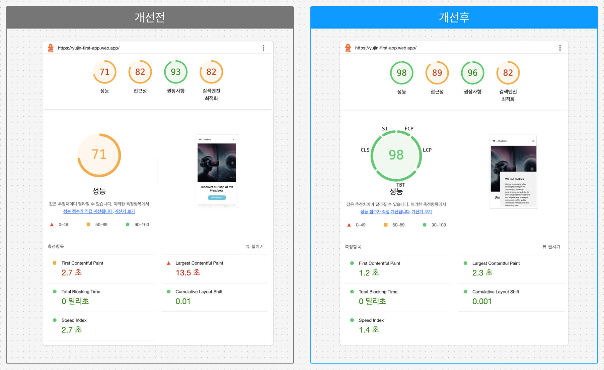

# 바닐라 JS 프로젝트 성능 개선
- url: https://yujin-first-app.web.app/

## 성능 개선 사후 보고서

### 1. 프로젝트 개요
#### 1.1 개선 이유
- Core Web Vitals 개선을 통한 사용자 경험 향상

#### 1.2 초기 성능 상태
##### 🎯 Lighthouse 점수
| 카테고리 | 점수 | 상태 |
|----------|------|------|
| Performance | 72% | 🟠 |
| Accessibility | 82% | 🟠 |
| Best Practices | 75% | 🟠 |
| SEO | 82% | 🟠 |
| PWA | 0% | 🔴 |

##### 📊 Core Web Vitals (2024)
| 메트릭 | 설명 | 측정값 | 상태 |
|--------|------|--------|------|
| LCP | Largest Contentful Paint | 14.63s | 🔴 |
| INP | Interaction to Next Paint | N/A | 🟢 |
| CLS | Cumulative Layout Shift | 0.011 | 🟢 |

### 2. 성능 개선 방법
|  개선 항목  |  개선 이유  |  개선 방법  |  향상된 지표  |
|---|---|---|---|
|  이미지 최적화  |  LCP 개선  |  오버사이즈 이미지 조정, 이미지 형식 변환, 이미지 압축  |  LCP: 14.63s → 3.75s  |
|  picture 태그 사용  |  반응형 이미지 최적화  |  화면 크기에 따라 다른 이미지 표시  |  LCP: 3.75s → 2.78s, FCP 2.7s → 2.2s |
|  명시적 이미지 크기 설정  |  CLS 개선, 레이아웃 안정화  |  이미지에 width와 height 속성 추가  |  LCP: 2.78s → 2.45s  |
|  국가 배너 레이아웃 시프트 제거  |  CLS 유지 및 LCP 개선  |  국가 배너 렌더링 로직 최적화  |  CLS: 0.01 → 0.001, LCP: 변동없음  |
|  이미지 Lazy Loading  |  초기 로딩 시간 단축  |  코드수정  |  LCP: 2.45s → 2.47s(약간증가) |
|  JS로딩 지연 및 연산최적화  |  전반적 성능 향상  |  중요하지 않은 스크립트 지연 로딩, 무거운 연산 개선  |  FCP 2.2s → 1.9s  |
|  Google Fonts 자체 호스팅  |  FCP, LCP 개선  |  폰트 파일 다운로드 및 호스팅  |  FCP 변동없음, LCP: 2.47s → 3.16s(약간증가)  |
|  비필수 서비스 로딩 지연  |  초기 로딩 속도 개선  |  코드수정  |  FCP 1.9s → 1.2s, LCP: 3.16s → 2.11s  |

### 3. 개선 후 향상된 지표
|  지표  |  초기 값  |  최종 값  |  개선율  |
|---|---|---|---|
|  LCP  |  13.5s  |  2.3s  |  83%  |
|  FCP  |  2.7s  |  1.2s  |  55.6%  |
|  CLS  |  0.01  |  0.001  |  90%  |
|  TBT  |  0  |  0  |  0%  |
|  Speed Index  |  2.7s  |  1.4s  |  48.1%  |
*모바일 기준

#### 🖥️ PageSpeed Insights (비교이미지)

### 4. 결론
- PageSpeed Insights 점수를 71에서 98로 개선하였습니다.
- LCP를 83% 개선하여 사용자의 체감 로딩 속도를 향상시켰습니다.
- 일부 작업(Lazy Loading, Google Fonts 자체 호스팅)에서 일시적 성능 저하가 있었으나, 전체적으로 모든 주요 성능 지표가 크게 개선되었습니다.
- 성능 최적화를 통해 사용자 경험이 향상되고 비즈니스 목표 달성에 긍정적인 영향을 줄 것으로 기대됩니다.